最近在学习java字节码增强相关的技术，接触到了javaassist、asm等重写字节码的工具，在使用javaassist的过程中感觉一切都很顺利，因为javaassist对字节码的所有操作都进行了高度的封装，用户使用起来相对来说比较简单，但是asm就不太一样了，它提供的api更接近java虚拟机的字节码指令，如果之前从没有接触过字节码指令，使用起来就很难受，而我就是那个之前从来没有接触过java字节码指令的人，在写asm的demo的时候我就感觉自己总是云里雾里的，为了解决这个问题，我干脆先补一补java字节码相关的知识。

前面提到了java字节码增强技术，而这种技术之所以能够流行起来还得归功于class文件那稳定的文件结构，所以首先让我们一起来看看class文件的结构吧：


无论一个类之前是什么模样，它在被编译成class文件过后，都会严格按照上面的格式**顺序存储**

为了让大家更直观的认识class文件的格式，我们可以自己编译一个class文件，并按照上述表格一点点拆分出这个class文件的所有部分

我所使用的类：
```java
package org.example;  
  
public class Axin {  
    private int age;  
  
    public Axin() {  
    }  
  
    public void sayHello() {  
        System.out.println("hello");  
    }  
}
```

将它编译成class文件后，然后随便用一个16进制编辑器打开(我这里直接用了一个IDEA里的插件`BinEd`)，可以看到下面这样的内容：

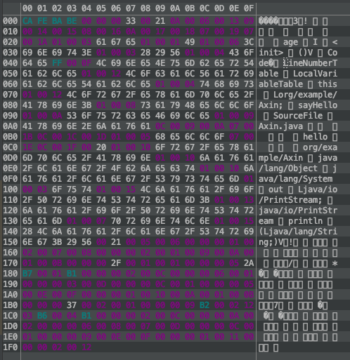


接下来，让我们一起根据上面的表格来拆分这个class文件吧


### 魔数

每个class文件的开头都会有一个魔数，这个魔数是用来标识这个文件是一个class文件的，很多图片前几个字节也会有这样的魔数，比如png图片的魔数为`89504E47`，GIF图片的魔数为`47494638`

从上面的表格中我们还可以看到这个魔数的类型为u4

这是什么意思呢？其实u4是表示这个魔数在class文件中会占用4个字节

除此之外，表格中还有一个字段是「数量」，它表示当前变量在一个class文件中有几个，比如魔数这个变量在每个class文件中就只有一个，又因为它的类型是u4，也就是说魔数在class文件中占用四个字节

并且，我们之前说过，class文件是严格按照上表的顺序组织数据的，所以，魔数就是class文件的前四个字节，也就是下面这几个字符：


可以看到class文件的魔数还是很浪漫的对吧——Cafe BaBe?

工作累了？来杯咖啡吧宝贝儿


### 版本号

我们继续来读表奥：


紧跟着魔数的2个字节是class文件的次版本号，再后面的两个字节是主版本号，而我们前面用到的那个class文件是使用java1.8编译的，从文件的16进制可以看到，它的次版本号是0，主版本号转换为十进制后就是`51`

> Java的版本号是从 45 开始的，JDK1.1 之后的每个 JDK 大版本发布主版本号向上加1（JDK1.0~JDK1.1使用了45.0~45.3的版本号），高版本的 JDK 能向下兼容以前版本的 Class 文件，但不能运行以后版本的 Class 文件，即使文件格式未发生变化。

按理说jdk1.8编译的class文件主版本号应该是`52`,可是我却得到了`51`，但是没关系，因为前面提到，高版本的jdk是可以向下兼容以前的版本的，所以jdk1.8也可以运行51版本的class文件


### 常量区

主版本号过后，就来到了我们的常量相关的区域

> 注意： 此处提到的常量和编程语言里面的常量不是一个概念

我们稍微用脑袋想想就知道不同的class文件肯定是拥有不同数量的常量的，也就是说常量在class文件中占用的空间不是固定的

如果你是class文件格式的设计者，你会采用什么办法告诉 JVM 常量区域的起始点呢？

比较容易想到的有两种方案：

- 设置分割符，用分隔符隔离开每个区域
- 设置一个标识位，在每个区域开始前标明这个区域会占用多少空间

如果采用分割符的话就会引入不必要的数据，class文件的设计者摒弃了这种方案，采用了后者

为了标记一个class文件中有多少常量，设计者引入了常量数这一变量（或者说标记）

让我们再瞄一眼之前提到的表格：

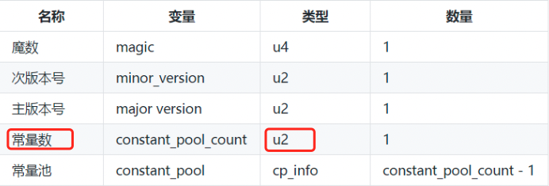

这个标记占两个字节


我们之前用到的class文件的常量数转换为十进制后就是`33`，也就是说常量池中存储了32个常量（常量池存储从1开始计数，0号位预留了）

在这个标记后紧跟着就是我们的常量池了，从这个名字就可以听出来，常量池中应该可以存储很多常量，这又和我们之前所接触到魔数、主版本号等不一样了，之前都是一个变量就存一个值，现在这个【常量池】变量中存了很多值。

所以，你可以简单的把之前提到的魔数、主版本号理解为编程语言中的字符串类型，把常量池理解为编程语言中的数组或者对象类型

这个常量池中存储的常量又分很多不同的类型，这些不同的类型都有一个唯一的tag值，见下表：

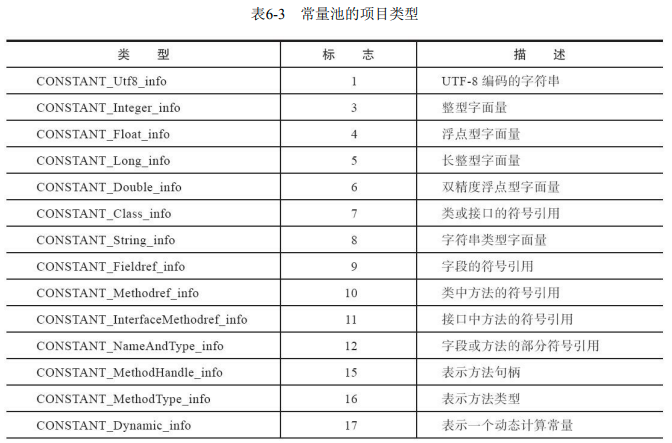

不同类型的常量，在class文件中的结构是不一样的，下表展示了每种常量在class文件中的存储结构：

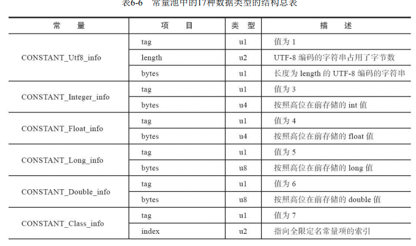

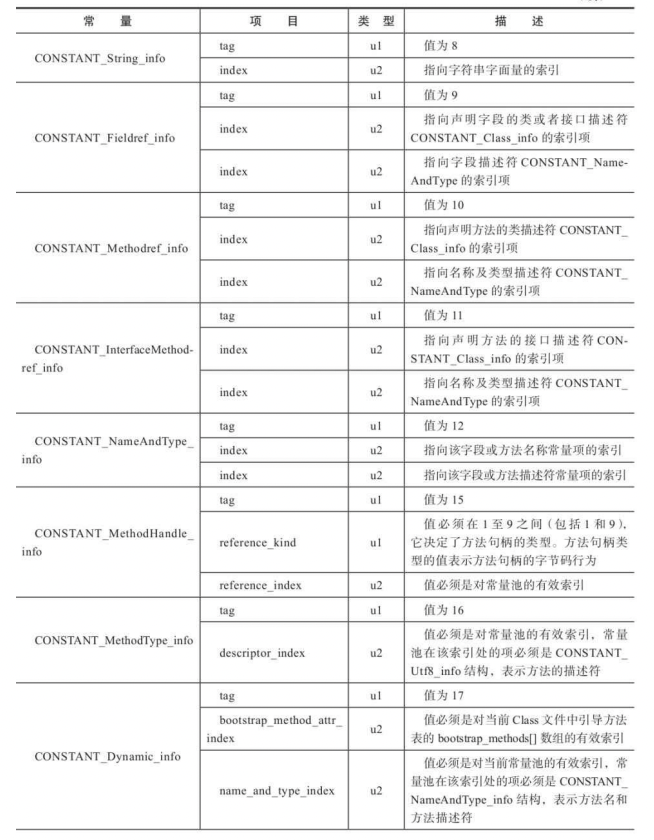


可以看到无论是哪种常量，他们都是以自己的tag值为开始，而tag值都是u1类型，也就是占一个字节。JVM只要识别出了这个tag值，就可以根据约定好的格式去读取这个常量剩下的部分

可能看到这里，大家就觉得有点复杂了，没关系，我们还是用之前的class文件来讲解

继常量数之后，就来到了常量池区域，常量池的第一个字节是`0A`，常量池的第一个字节也是第一个常量的tag，`0A`转换为十进制过后就是`10`，也就是说常量池中的第一个常量是`CONSTANT_Methodref_info`，我们去看一下`CONSTANT_Methodref_info`常量的结构：


从上表可知，除了之前的tag外，后面还有四个字节是属于它的，这四个字节又分成两部分，两个字节为一对，他们都是index(索引)，前一个index指向声明该方法的类描述符（该方法属于哪个类），后一个index指向该方法的名称及类型描述符（名称及返回值等等）

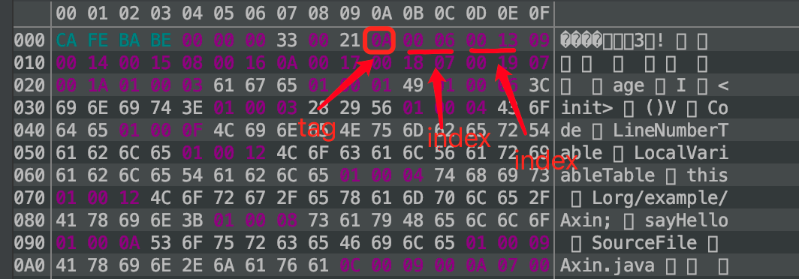

拆分出第一个常量过后，我们接着往下看，下一个字节的值是`09`，通过查表可知，它是`CONSTANT_Fieldref_info`标志，也就是说常量池中存储的第二个常量就是`CONSTANT_Fieldref_info`，我们查一下这个常量的结构：


然后又可以很轻松的从class文件中拆分出第二个常量🌶：

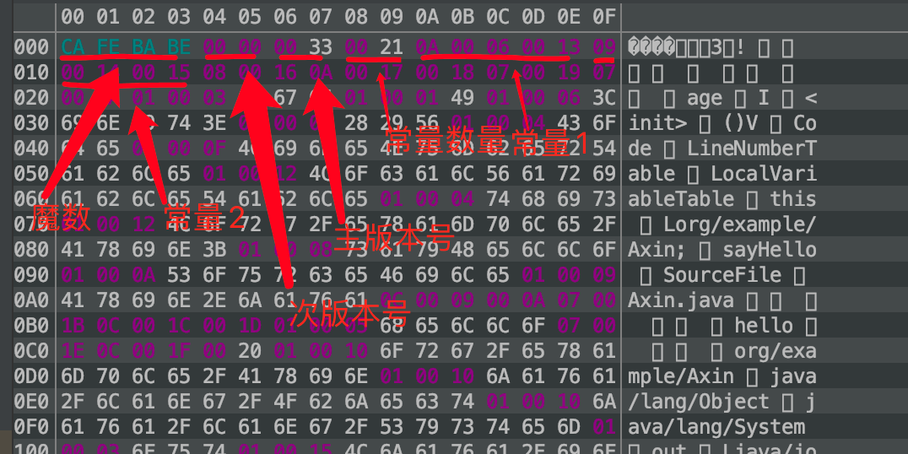

通过这种方式我们可以拆分出常量池中的所有常量，但是，可能我也会累死~

我们不妨借助点外力，使用命令`javap -verbose 类名`可以反编译类文件，通过反编译`Axin.class`文件，我们得到了下面这样的内容：

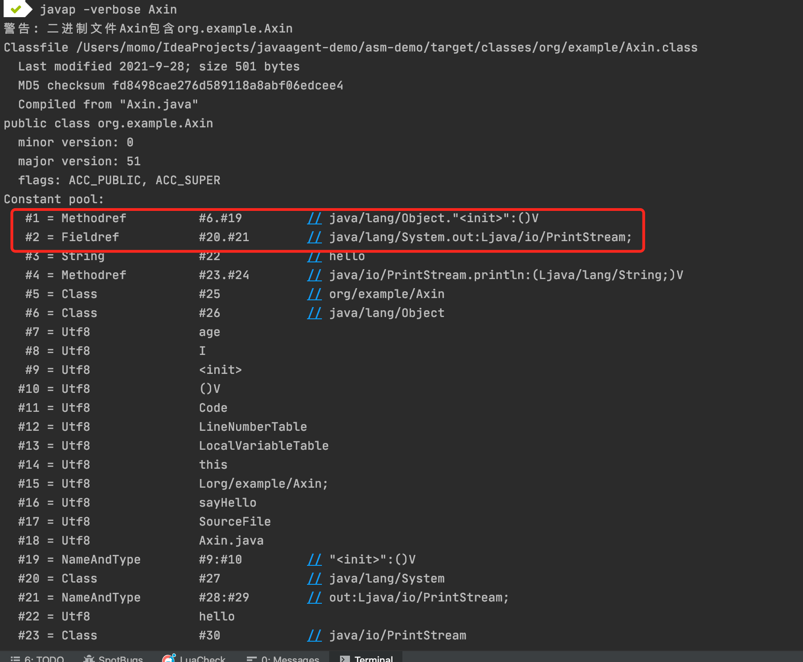

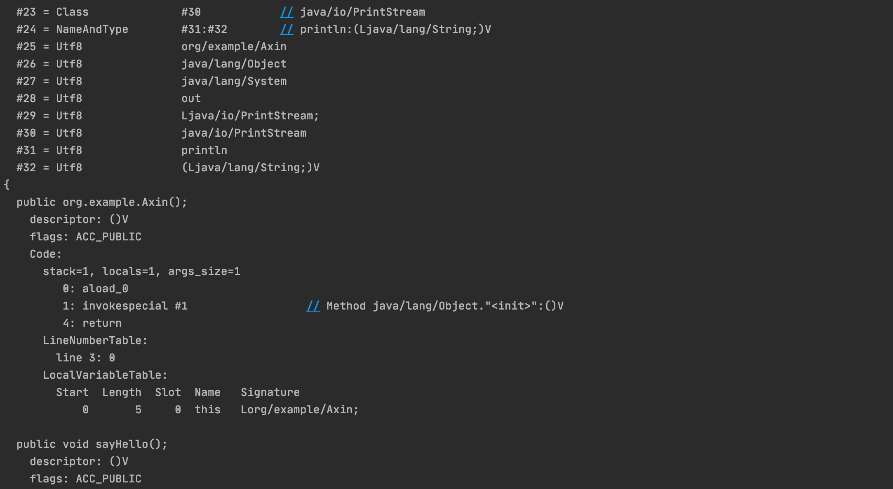

我们把注意力放在Constant Pool区域，可以看到通过javap反编译出来的文件，常量池的前两个常量就是我们之前说的Methodref和Fieldref

并且Methodref的两个index分别为6和19也完全没有问题，那么这两个数字代表啥呢？

其实它们代表着索引常量池中的哪一个位置的常量，比如index=6就表示索引常量池中的第六个常量，从上图我们也可以看到常量池中的第六个常量是Class，而这个Class又指向了常量池中的第26个常量，也就是`java/lang/Object`字符串，而index=19最终索引下来，指向了`"<init>":()V`字符串，所以我们常量池中的第一个常量其实可以理解为Axin类默认的构造函数

从上面的图片我们也大概可以看到常量池中存储的常量和我们编程语言中的常量还是有点区别的，class文件中的常量有两大类：

1、字面量（Literal）：字面量比较接近于 Java 语言层面的常量概念，比如 文本字符串、被声明为 final 的常量值等。

2、符号引用（Symbolic References）：符号引用属于编译原理方面的概念，包括下面三类常量：

　- 类和接口的权限定名（Fully Qualified Name）
　- 字段的名称和描述符（Descriptor）
　- 方法的名称和描述符。
	
	
### 访问标志

常量池过后就来到了我们的访问标志，它占两个字节，这个标志用于识别一些类或 者接口层次的访问信息，包括：这个Class是类还是接口；是否定义为public类型；是否定义为abstract 类型；如果是类的话，是否被声明为final等等

下表是不同访问标志对应的标志值：

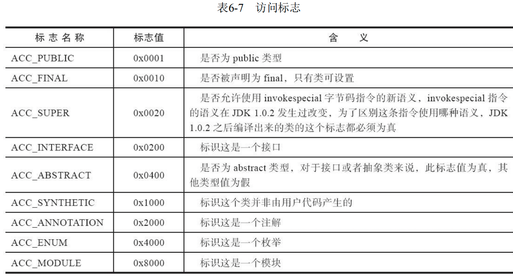

因为我们之前使用的`Axin.class`不是接口、枚举、注解或者模 块，被public关键字修饰但没有被声明为final和abstract，并且它使用了JDK 1.2之后的编译器进行编 译，因此它的ACC_PUBLIC、ACC_SUPER标志应当为真，所以它的access_flags值为：`0x0001|0x0020=0x0021`。

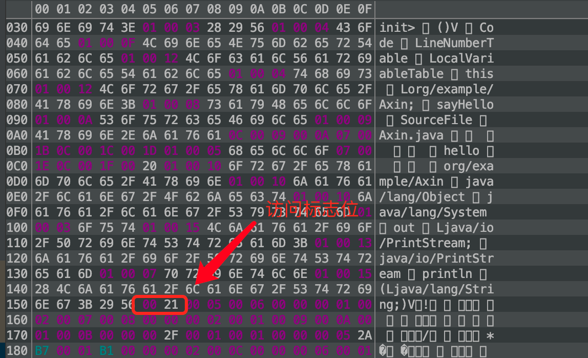


### 类索引、父类索引与接口索引集合

访问标志过后就来到了确定类继承关系的几个区域，分别是：类索引（this_class）、父类索引（super_class）、接口数量以及接口池

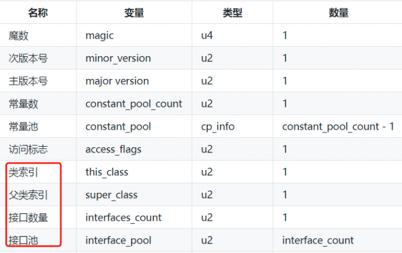

从表中可以看到类索引和父类索引都是占两个字节，还有，这些索引都是索引的常量池中的常量，还是以`Axin.class`文件为例

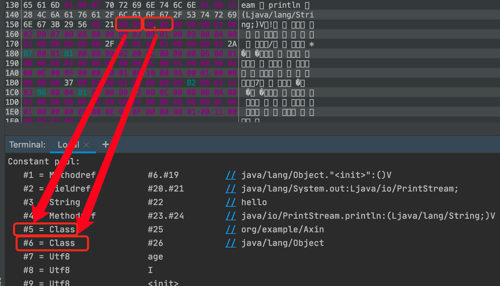

可以看到类索引最终索引到了`org/example/Axin`，父类索引最终索引到了`java/lang/Object`，很合理嘛，毕竟在java中，所有类都是Object类的子类。

由于在Java中没有多继承，每个类只有一个父类，所以父类索引很容易就确定下来了

但是，一个类可以实现多个接口啊，和之前提到的常量一样，一个类文件有多少个接口也是不确定的，所以这里又用到了一个接口池来存储所有的接口

同样的，在接口池之前也有一个接口数量标志位，接口数量占两个字节

由于`Axin`类没有实现任何接口，所以接口数量为0，那么接口池也就没了（在class文件中不占用任何字节）

### 字段表集合

现在，我们终于来到了类的字段相关的区域：

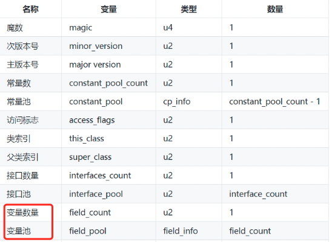

这里的变量其实就是类或接口中的Field(字段)，不包括方法内部声明的局部变量

和常量一样，字段的数量也是不定的，所以又采用了"xx池"的设计方式，变量池中的每一个变量都是按照下面这样的结构存储的：


它们分别代表着：访问标志、字段名、字段描述、属性数量、属性池

访问标志或者说修饰符有：字段的作用域（public、private、protected修饰 符）、是实例变量还是类变量（static修饰符）、可变性（final）、并发可见性（volatile修饰符，是否 强制从主内存读写）、可否被序列化（transient修饰符），这些信息都是布尔值，要么有，要么没有，很容易用标志位来标识


而字段名和字段被定义为什么类型都是不定的，只能索引常量池中的常量来描述

我们的`Axin.class`文件中正好定义了一个字段，现在，让我们一起从class文件中找出它吧

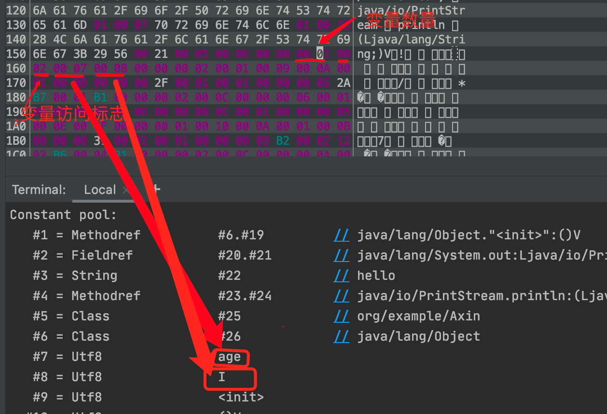

从class文件中，我们可以看到变量数量为1，第一个变量的访问标志为`0002`，对应着`private`，而变量名是`age`，变量类型为`I`，这个`I`表示Integer

> 基本数据类 型（byte、char、double、float、int、long、short、boolean）以及代表无返回值的void类型都用一个大 写字符来表示，而对象类型则用字符L加对象的全限定名来表示，
> 

字段描述后的两个字节是属性数量，由于`Axin.class`文件中的age字段没有额外的信息，所以属性数量为`0000`，如果代码中的是`int age = 18`，属性池里应该就会有一些信息，大家可以自行分析一下

### 方法表集合

字段表过后就是方法表了

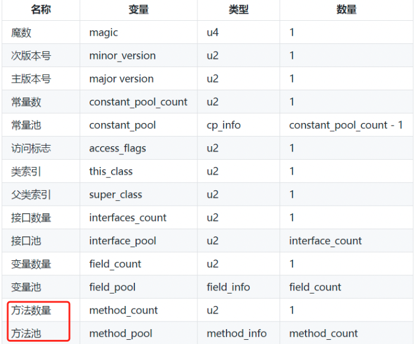

方法池中存放的方法结构和字段的结构很相似：


也是依次包括：访问标志（access_flags）、名称索引（name_index）、描述符索引（descriptor_index）、属性表集合数量（attributes_count）、属性表集合（attributes）

访问标志同样有一张表：

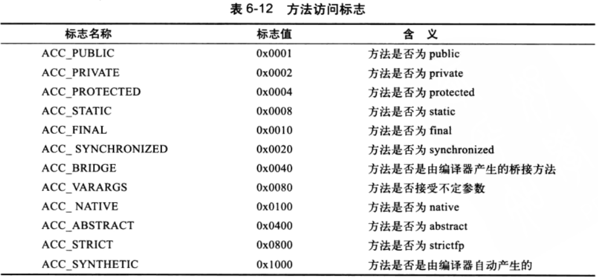

然后方法表的名称索引和描述符索引的逻辑和之前字段表一样，我就不再过多解释了


现在，通过访问标志、名称索引以及描述符索引我们可以很容易搞清楚一个方法的定义，但是方法里实现的代码逻辑去哪里了？

别着急啊，每个方法表中不是还有一个属性表吗，方法的具体代码指令是存放在一个名为Code的属性中的，当然，除了Code属性之外，jvm中还有以下这些属性（表格仅列举一部分），不过本文我们只关注Code属性。

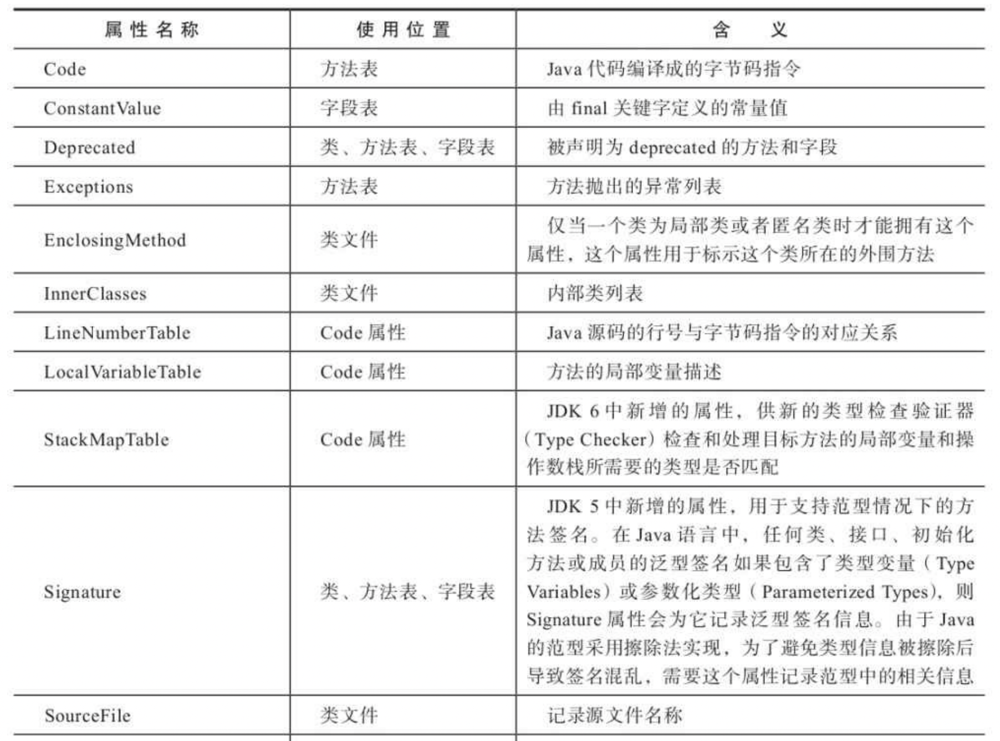

属性的通用格式如下：


前两个字节是属性名称索引，再后面四个字节表示属性值的长度，最后一部分就是属性值了，【属性值】所占用的字节就是【属性值的长度】位的值，可以看到属性值是拥有很大的灵活性的，不同属性的差异也主要体现在这里

比如，Code属性的格式就是下面这样了：

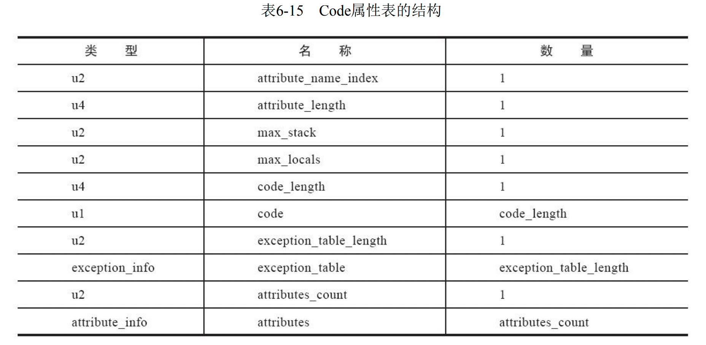

看了这么多表格，可能大家已经晕了，我们还是直接拆分`Axin.class`吧：

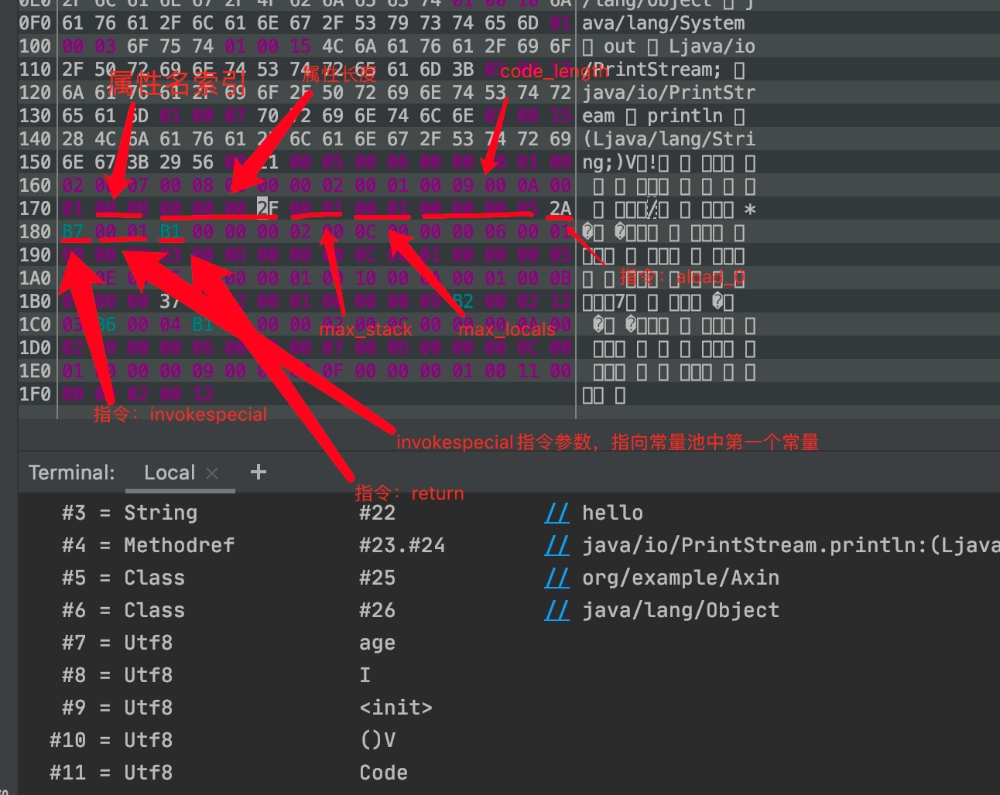

我这里就只拆分到我关心的code部分，大家如果感兴趣可以继续拆分😂

至此，我相信大家对class文件的结构应该有一个大体的认识了吧。